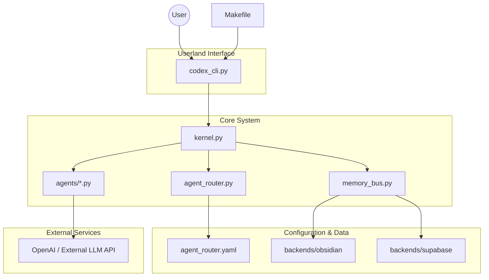
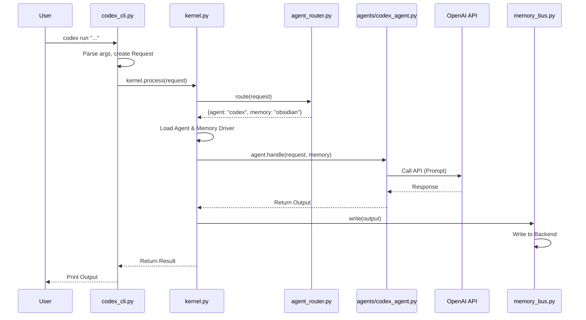

# Artemis Kernel Architecture & Specification

## 1. Technical Architecture Diagram (Build-Time)
This diagram illustrates the static structure of the Artemis-City system, showing files, subsystems, and their connections.

**Components:**
- **codex_cli.py**: Userland command interface. Parses args, creates Request objects.
- **kernel.py**: Core dispatcher and execution loop. Loads config, routing, and agents.
- **agent_router.py**: Command routing logic. Tokenizes input, matches keywords, selects agents/memory.
- **memory_bus.py**: Memory abstraction layer. Handles read/write to Obsidian/Supabase.
- **agents/*.py**: Specific agent implementations (Codex, Planner, etc.).

## 2. Run-Time Execution Pipeline
This pipeline describes the flow of control when a user executes a command like `$ codex run "generate schema for my finances"`.

**Execution Steps:**
1.  **User Input**: CLI receives command.
2.  **CLI Processing**: `codex_cli.py` parses args and calls `kernel.process`.
3.  **Routing**: `kernel.py` calls `agent_router.py` to determine the target agent and memory backend.
4.  **Dispatch**: `kernel.py` initializes the selected agent and context.
5.  **Agent Execution**: Agent constructs the prompt and calls the LLM.
6.  **State Update**: Kernel receives output, updates state (`state_kernel.json`).
7.  **Memory Persistence**: Kernel directs `memory_bus.py` to store results.
8.  **Output**: Result is returned to CLI and displayed to the user.

## 3. Kernel Responsibilities & Specification

The **Artemis-City Kernel** acts as the virtual operating system for agents.

### 3.1 Command Processing
-   **Input**: Raw CLI strings or structured requests.
-   **Output**: Standardized kernel command objects.

### 3.2 Agent Routing
-   **Mechanism**: Keyword matching, priority rules, pipeline configurations.
-   **Output**: Selection of one or more agents to handle the task.

### 3.3 Memory Management
-   **Router**: Directs I/O to appropriate backends (Obsidian, Supabase, JSON state).
-   **Abstraction**: Provides a unified API for agents to read/write memory without knowing the backend details.

### 3.4 Model Invocation
-   **Gateway**: Centralized handling of API calls to LLMs (OpenAI, etc.) via agents.

### 3.5 State Persistence
-   **Kernel State**: Maintains execution logs, active context, and system health in `state_kernel.json`.

### 3.6 Multi-Agent Pipelining
-   **Chaining**: Supports workflows like `Planner -> Codex -> Memory`.

## 4. Implementation Guide

### 4.1 Boot Sequence
1.  **Install**: `pip install -e .` (registers `codex` binary).
2.  **Run**: `codex [command]`.
3.  **Flow**: `codex_cli.py` -> `kernel.py` -> ...

### 4.2 File Structure Mapping
-   `/codex_cli.py`: Entry point.
-   `/kernel.py`: Main logic.
-   `/agent_router.py`: Logic for selection.
-   `/memory_bus.py`: Data layer.
-   `/agents/`: Agent implementations.
-   `/backends/`: Database/Vault drivers.

This specification serves as the blueprint for the Artemis-City Core implementation.
